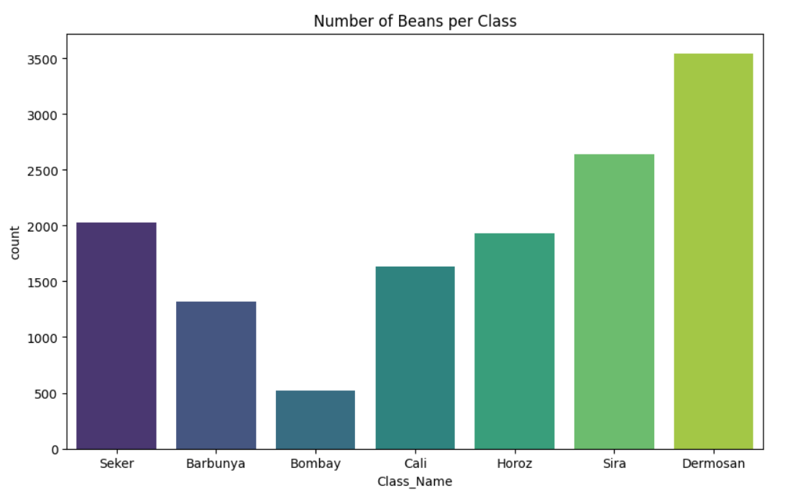
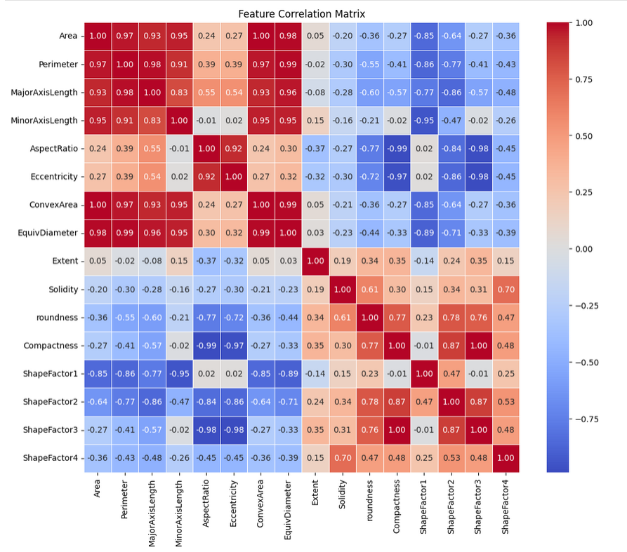

# Data Analysis on Dry Bean and Gas Turbine Datasets

For now I think I'm done with Dry Bean.  
Some key things, data is unbalanced so we need to stratisfy it so that data doesn't get a bias. We do split the data into 3 folds (as required in the excel sheet) so we use cross validation for that. We use StandartScaler() so that big numbers doesn't overwhelm the small ones.

On Gas Turbine, we are only required to work on 'lbl2'. I haven't done any work on that one so far.

## Requirements
- Jupyter (I would recommend you just run the notebook)
- Python 3.x
- Scipy
- Numpy
- Pandas
- Seaborn
- Matplotlib
- Scikit-learn

```
pip install scipy numpy pandas seaborn matplotlib scikit-learn jupyter 
```
### How to run
Simply run this and run the program through notebook
```
jupyter notebook
```

# Dry Bean

## Is the data clean?

Let's see if there is any missing data (Any non-zero values would be missing)
```
print(df.isnull().sum())

df.info()
```
```
Area               0
Perimeter          0
MajorAxisLength    0
MinorAxisLength    0
AspectRatio        0
Eccentricity       0
ConvexArea         0
EquivDiameter      0
Extent             0
Solidity           0
roundness          0
Compactness        0
ShapeFactor1       0
ShapeFactor2       0
ShapeFactor3       0
ShapeFactor4       0
Class              0
ClassName          0
dtype: int64
<class 'pandas.core.frame.DataFrame'>
RangeIndex: 13611 entries, 0 to 13610
Data columns (total 18 columns):
 #   Column           Non-Null Count  Dtype  
---  ------           --------------  -----  
 0   Area             13611 non-null  float64
 1   Perimeter        13611 non-null  float64
 2   MajorAxisLength  13611 non-null  float64
 3   MinorAxisLength  13611 non-null  float64
 4   AspectRatio      13611 non-null  float64
 5   Eccentricity     13611 non-null  float64
 6   ConvexArea       13611 non-null  float64
 7   EquivDiameter    13611 non-null  float64
 8   Extent           13611 non-null  float64
 9   Solidity         13611 non-null  float64
 10  roundness        13611 non-null  float64
 11  Compactness      13611 non-null  float64
 12  ShapeFactor1     13611 non-null  float64
 13  ShapeFactor2     13611 non-null  float64
 14  ShapeFactor3     13611 non-null  float64
 15  ShapeFactor4     13611 non-null  float64
 16  Class            13611 non-null  uint8  
 17  ClassName        13611 non-null  object 
dtypes: float64(16), object(1), uint8(1)
memory usage: 1.8+ MB
```
As shown in the output, there are non-zero values thus there are no missing data

## Is the data balanced?
Do we have equal amounts of 'Seker' compared to 'Bombay'?
```
import seaborn as sns
import matplotlib.pyplot as plt

plt.figure(figsize=(10, 6))
sns.countplot(x='Class_Name', data=df, hue='Class_Name', palette='viridis', legend=False)
plt.title('Number of Beans per Class')
plt.show()
```



The data exhibits significant class imbalance. As shown in the chart, the minority class "Bombay" (~500 samples) is vastly underrepresented compared to majority class "Dermosan" (~3500 samples). This imbalance may cause the model to be biased towards predicting "Dermosan" more frequently.  

Because of this imbalance, we should use metrics like **F1-Score** or a **Confusion Matrix** to evaluate our model, rather than relying solely on Accuracy. 

## Which features matter?
```
# We're taking only numbers
numeric_df = df.select_dtypes(include=['float64', 'int64', 'int32'])

# Correlation
corr_matrix = numeric_df.corr()

# Plot heatmap
plt.figure(figsize=(12, 10))
sns.heatmap(corr_matrix, annot=True, fmt=".2f", cmap='coolwarm', linewidths=0.5)
plt.title('Feature Correlation Matrix')
plt.show()
```



### Redundancy
Area, ConvexArea and EquivDiameter all have a correlation of 1.00 or 0.99  

These three features are mathematically almost identical. If a bean is big, it has a big area, a big convex area, and a big diameter. You essentially have the same information repeated 3 times.  

Compactness vs. ShapeFactor3: Also 1.00. These are likely calculated using the exact same formula variable (e.g., one is just the square of the other).

### Inverse Relationships
Compactness v. Aspect Ratio (-0.99), if a bean gets longer, it becomes less compact

### Why this even matter?
For smart models like Random Forest, Decision Trees, they'll figure it out and ignore the duplicates.  

For math models like Logistic Regression, SVM, Neural Networks, this can cause issues (multicollinearity). The model gets confused about which of the 3 "Area" features is essentially responsible for the result.

## Preprocessing
Data has different scales (e.g., Area is 30,000 but Compactness is 0.8), we need to scale the data. If we don't, the model will think Area is the most important feature just because it has huge numbers.  

We are required to split the dataset into 3 folds. (k-fold: 3)

```
from sklearn.model_selection import cross_validate, StratifiedKFold
from sklearn.pipeline import make_pipeline
from sklearn.svm import SVC

# Defining the pipeline
# Preprocessing and Model
clf_pipeline = make_pipeline(StandardScaler(), SVC(kernel='rbf', random_state=42))

# "Stratified" ensures each fold keeps the same ratio of Bombay/Seker beans
cv = StratifiedKFold(n_splits=3, shuffle=True, random_state=42)

# Run K-Fold and Calculate Metrics
# We ask for both 'accuracy' and 'f1_weighted' (Weighted handles the class imbalance better)
scoring_metrics = ['accuracy', 'f1_weighted']

results = cross_validate(clf_pipeline, X, y, cv=cv, scoring=scoring_metrics)

print(f"K-Fold (k=3) Results:")
print(f"  - Mean Accuracy: {results['test_accuracy'].mean():.4f}")
print(f"  - Mean F-Score:  {results['test_f1_weighted'].mean():.4f}")

# See scores for each individual fold
print(f"\nIndividual Folds Accuracy: {results['test_accuracy']}")
```
```
K-Fold (k=3) Results:
  - Mean Accuracy: 0.9282
  - Mean F-Score:  0.9283

Individual Folds Accuracy: [0.9226361  0.9292484  0.93277496]
```

The Support Vector Machine (SVM) classifier with an RBF kernel was evaluated using 3-Fold Cross-Validation. The model achieved a Mean Accuracy of 92.82% and a Mean F-Score of 0.9283. The consistency across folds (Standard Deviation < 0.01) indicates the model is robust and generalizes well to unseen data. The alignment between Accuracy and F-Score suggests that the class imbalance was successfully mitigated through stratification and weighted evaluation.  

A mean accuracy of 92.82% with an F-Score of 0.9283 confirms that the model handles the class imbalance very well (since the F-Score didn't drop significantly below accuracy).  
Individual folds are 0.922, 0.929 and 0.932. This proves the model is stable  

Because we used `f1_weighted` and `stratify`, the fact that F-Score matches the Accuracy means the model isn't ignoring the small classes (like "Bombay").  

Following section is for visualization purposes only  
For that to happen, we're going to use `cross_val_predict` instead. This functions acts like cross_validate, but instead of returning scores, it returns the predictions for every single bean when it was part of a "Test Fold." This allows us to build one "Master Confusion Matrix" for the entire dataset.  

How `cross_val_predict` works is that, we have 3 folds in `cv` variable when we call the function. Let's call the folds A, B and C. It does 3 rounds of predictions.  
For the first one for example, it hides fold A and trains the model on B & C. Then predict A.  
For second round, hides B and trains A & C. Then predict B  
Lastly, hides C and trains A & B. Then predict C  

It takes those three separate lists of predictions and glues them back together in the original order. Now we have a prediction for every single bean in the dataset, but every single prediction was made by a model that had never seen that bean during training.  

| Command | What it Returns | Used For |
| --- | --- | --- |
|`cross_validate` | "Numbers (e.g., `[0.92, 0.93, 0.91]`) | Checking if the model is good/stable.
|`cross_val_predict` | "Labels (e.g., `[Seker, Bombay, ...]`) | Finding where the model makes mistakes (Confusion Matrix).  

```
from sklearn.model_selection import cross_val_predict
from sklearn.metrics import confusion_matrix
import seaborn as sns
import matplotlib.pyplot as plt

# Get predictions for every data point using Cross-Validation
# This runs the 3-fold loop again but saves the predictions instead of the score
y_pred_cv = cross_val_predict(clf_pipeline, X, y, cv=cv)

# Create the Confusion Matrix
cm_cv = confusion_matrix(y, y_pred_cv)

# Plot it
plt.figure(figsize=(10, 8))
sns.heatmap(cm_cv, annot=True, fmt='d', cmap='Blues',
            xticklabels=class_mapping.values(),
            yticklabels=class_mapping.values())
plt.ylabel('Actual Class')
plt.xlabel('Predicted Class (aggregated across 3 folds)')
plt.title('Aggregated Confusion Matrix (3-Fold CV)')
plt.show()
```


